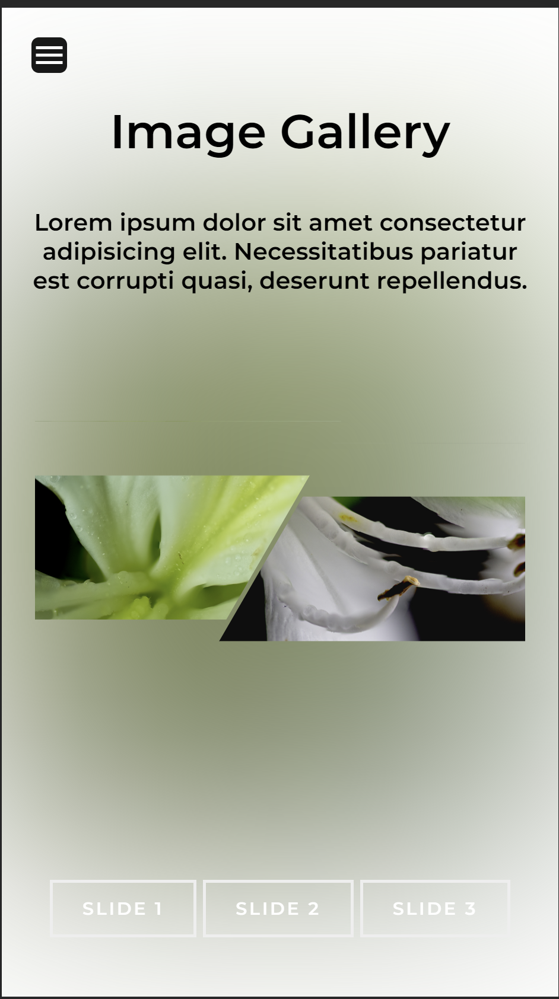
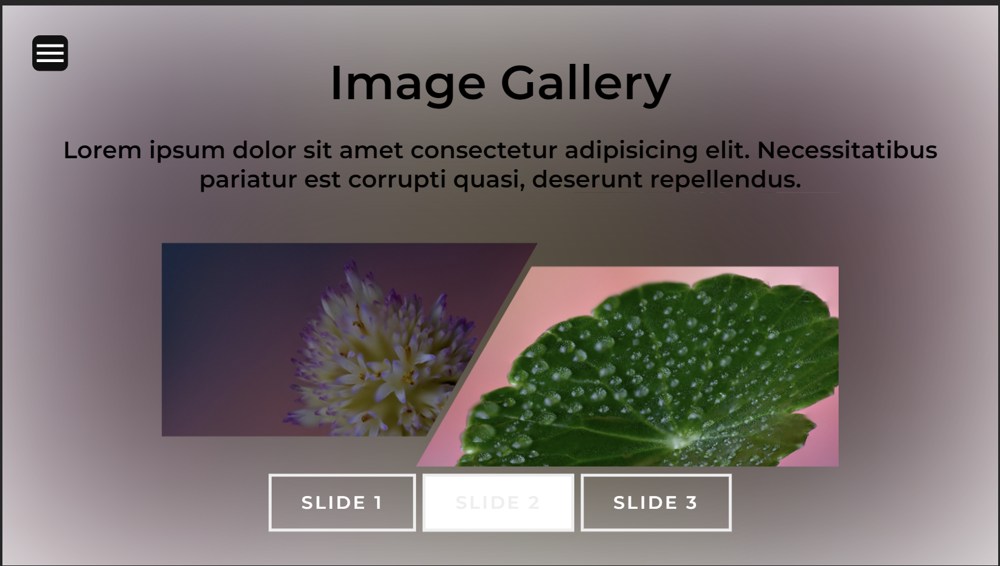

# Image Slide Gallery

[Image Gallery Site](https://m2paulc.github.io/image-gallery)

We take photos and selfies all day long with our smart phone. To keep photos organize, I have created an image gallery and the main advantage of this app is that it will cache all images in the initial load so no server-side rendering occurs. The slides are by pair to showcase each images.

## Summary: 

This app was both fun and challenging to build. I like incorporating creative art into the apps I build and this is the perfect case to showcase that with subtle animations and color contrast. 

What I find challenging is using SVG elements to encapsulate the images to render. Keeping the main window equal no matter the size of the images. Working with SVG can have so many gotchas where I have come across quite few times. I finally got to solved some of this by adjusting the size of the main window, then use javascript to load the slides to render.

There is no framework used in this other than plain HTML, CSS and vanilla Javascript. I also utilized the Greensock library (GSAP) here for animation purposes. It's a good change and also a practice for me rather than just using CSS to animate elements.

<h2>Author</h2>
Paul Caoile | Front-End Developer

